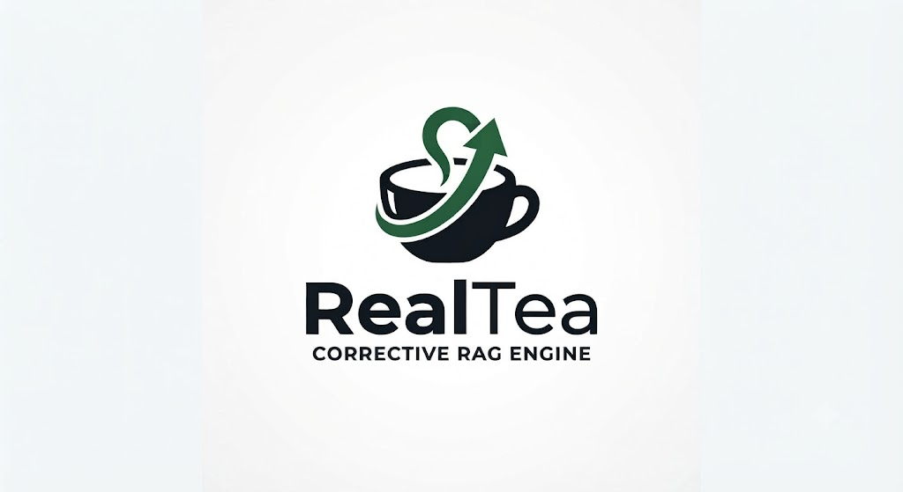

<p align="center">
  
</p>

<p align="center">
  
  
  
  
  
</p>

> **"Get the real tea from your documents — no hallucinations, just verified evidence."**

**RealTea** is an open-source, production-grade implementation of the **Corrective Retrieval-Augmented Generation (CRAG)** framework. It pairs a **LangGraph StateGraph** pipeline with a sleek, minimalist editorial interface inspired by **[Nokta](https://nokta.framer.website/)**.

Traditional RAG systems blindly trust whatever context their retriever returns. When retrieval goes wrong, the generator hallucinates. RealTea solves this with an active evaluation loop: it scores retrieved chunks, triggers deterministic state transitions (`CORRECT`, `INCORRECT`, `AMBIGUOUS`), queries the live web via **Tavily** when internal documents fall short, strips sentence-level noise, and produces factually grounded answers.

---

## 📄 Research Paper Reference

This project is directly built upon the concepts and algorithmic formulations introduced in:

> **"Corrective Retrieval Augmented Generation"**  
> *Shi-Qi Yan, Jia-Chen Gu, Yun Zhu, Zhen-Hua Ling*  
> *USTC • UCLA • Google DeepMind*  
> **arXiv**: [arXiv:2401.15884v3](https://arxiv.org/abs/2401.15884) `[cs.CL]` (October 2024)  
> 📖 **Included Paper PDF**: [`docs/paper/2401.15884v3.pdf`](docs/paper/2401.15884v3.pdf)  
> 📑 **In-Depth Technical Summary**: [`docs/paper_summary.md`](docs/paper_summary.md)

---

## ✨ Key Capabilities

- 🎯 **Continuous Relevance Evaluation**: An LLM judge evaluates retrieved chunks on a continuous scale ($0.0 - 1.0$) against configurable dual confidence thresholds (`UPPER_TH = 0.7`, `LOWER_TH = 0.3`).
- 🔀 **Deterministic Tri-Action Routing**:
  - 🟢 **`CORRECT`** ($\ge 0.7$): Uses high-confidence internal textbook knowledge and refines sentence strips.
  - 🔴 **`INCORRECT`** ($< 0.3$): Discards irrelevant internal chunks and triggers an external web search.
  - 🟡 **`AMBIGUOUS`** ($0.3 - 0.7$): Fuses internal textbook context with supplementary web intelligence.
- ✂️ **Decompose-Then-Recompose Refinement**: Breaks candidate text passages into atomic sentence strips and filters out noise and tangents before synthesis.
- 🔍 **Keyword & Recency Query Reformulation**: Transforms conversational queries into search-engine-optimized keyword queries with temporal boundaries (e.g. `(last 30 days)`).
- ⚡ **Multi-Engine Switching**: Seamlessly toggle between **Google Gemini 3.5 Flash Lite** (default), **OpenAI GPT-4o-mini**, and **DeepSeek Chat** at runtime.
- 🎨 **Minimalist Editorial UI**: Floating pill navigation bar, live studio clock (`STUDIO [HH:MM:SS]`), interactive StateGraph visualizer, and audit trace inspector.

---

## 🏛️ Pipeline Architecture

```
                              [ User Question ]
                                      │
                                      ▼
                             ┌─────────────────┐
                             │   1. RETRIEVE   │ (FAISS Top-K Search)
                             └────────┬────────┘
                                      │
                                      ▼
                           ┌─────────────────────┐
                           │  2. EVAL_EACH_DOC   │ (Relevance Scoring)
                           └──────────┬──────────┘
                                      │
                           ┌──────────┴──────────┐
                           │   route_after_eval  │
                           └──────────┬──────────┘
                                      │
                 ┌────────────────────┴────────────────────┐
                 │                                         │
        [Verdict: CORRECT]                     [Verdict: INCORRECT / AMBIGUOUS]
                 │                                         │
                 │                                         ▼
                 │                              ┌─────────────────────┐
                 │                              │  3. REWRITE_QUERY   │ (Keywords & Recency)
                 │                              └──────────┬──────────┘
                 │                                         │
                 │                                         ▼
                 │                              ┌─────────────────────┐
                 │                              │    4. WEB_SEARCH    │ (Tavily Fallback)
                 │                              └──────────┬──────────┘
                 │                                         │
                 └────────────────────┬────────────────────┘
                                      │
                                      ▼
                             ┌─────────────────┐
                             │    5. REFINE    │ (Sentence Strip Judge)
                             └────────┬────────┘
                                      │
                                      ▼
                             ┌─────────────────┐
                             │   6. GENERATE   │ (Bounded Tutor Synthesis)
                             └────────┬────────┘
                                      │
                                      ▼
                                   [ END ]
```

---

## 🚀 Quickstart in 3 Steps

### 1. Clone & Configure
```bash
git clone https://github.com/your-username/RealTea.git
cd RealTea

cp .env.example .env
```
Edit `.env` and add your API credentials:
```ini
GEMINI_API_KEY=your_gemini_api_key_here
OPENAI_API_KEY=your_openai_api_key_here
TAVILY_API_KEY=your_tavily_api_key_here
```

### 2. Launch
```bash
chmod +x start.sh
./start.sh
```

### 3. Open in Browser
Visit **`http://localhost:8080`** to access RealTea Studio.

---

## 📚 Complete Documentation Suite

Detailed guides are available in the [`docs/`](docs/) directory:

| Guide | Description |
| :--- | :--- |
| 📐 [**Architecture Blueprint**](docs/architecture.md) | LangGraph StateGraph design, state schema, chunking strategy, and multi-provider design. |
| 🛠️ [**Setup & Installation Guide**](docs/setup.md) | Prerequisites, virtual environment, frontend build, manual dev mode, and troubleshooting. |
| 🔌 [**REST API Reference**](docs/api.md) | Full endpoint documentation, request/response schemas, status codes, and `curl` examples. |
| 📑 [**Research Paper Summary**](docs/paper_summary.md) | Comprehensive technical analysis of the CRAG paper (arXiv:2401.15884v3) and algorithm mapping. |

---

## 📂 Project Structure

```
RealTea/
├── .env.example             # Environment variable template
├── .gitignore               # Excludes secrets, node_modules, .venv, dist/
├── LICENSE                  # MIT Open Source License
├── README.md                # Repository overview and quickstart
├── requirements.txt         # Python dependencies (FastAPI, LangGraph, FAISS)
├── start.sh                 # One-click startup script (venv, build, launch)
│
├── backend/                 # FastAPI & LangGraph CRAG backend
│   ├── config.py            # Environment, thresholds, and path settings
│   ├── crag_engine.py       # LangGraph StateGraph pipeline definition
│   ├── models.py            # Pydantic schemas for requests, responses & traces
│   ├── server.py            # FastAPI REST endpoints and SPA static server
│   └── vector_store.py      # FAISS vector store ingestion and retrieval
│
├── frontend/                # React 18 + Vite + Tailwind CSS application
│   ├── src/
│   │   ├── components/      # UI components (QueryConsole, GraphView, etc.)
│   │   ├── App.jsx          # Main application shell
│   │   └── index.css        # Nokta-inspired design tokens
│   ├── index.html
│   ├── package.json
│   └── vite.config.js
│
├── docs/                    # Technical documentation suite
│   ├── architecture.md      # Comprehensive architecture & data flow
│   ├── setup.md             # Developer setup and troubleshooting
│   ├── api.md               # REST API reference and curl examples
│   ├── paper_summary.md     # In-depth technical summary of CRAG paper
│   └── paper/
│       └── 2401.15884v3.pdf # Original research paper PDF
│
├── corrective-rag-main/     # Research notebooks & reference documents
│   ├── 1_basic_rag.ipynb
│   ├── 2_retrieval_refinement.ipynb
│   ├── 3_retrieval_evaluator.ipynb
│   ├── 4_web_search_refinement.ipynb
│   ├── 5_query_rewrite.ipynb
│   ├── 6_ambiguous.ipynb
│   └── documents/           # Reference textbooks (INSPIRED, Chasm, Zero to One)
│
├── storage/                 # Local FAISS vector storage (auto-generated)
└── tests/                   # Automated pipeline integration tests
    └── test_crag.py
```

---

## 🧪 Testing & Verification

Run the integration test suite to verify retrieval, LLM evaluation, query rewriting, web search fallback, and synthesis:

```bash
# Activate your virtual environment
source .venv/bin/activate

# Execute test suite
python3 tests/test_crag.py
```

---

## 📄 License

This project is open-sourced under the [MIT License](LICENSE).
