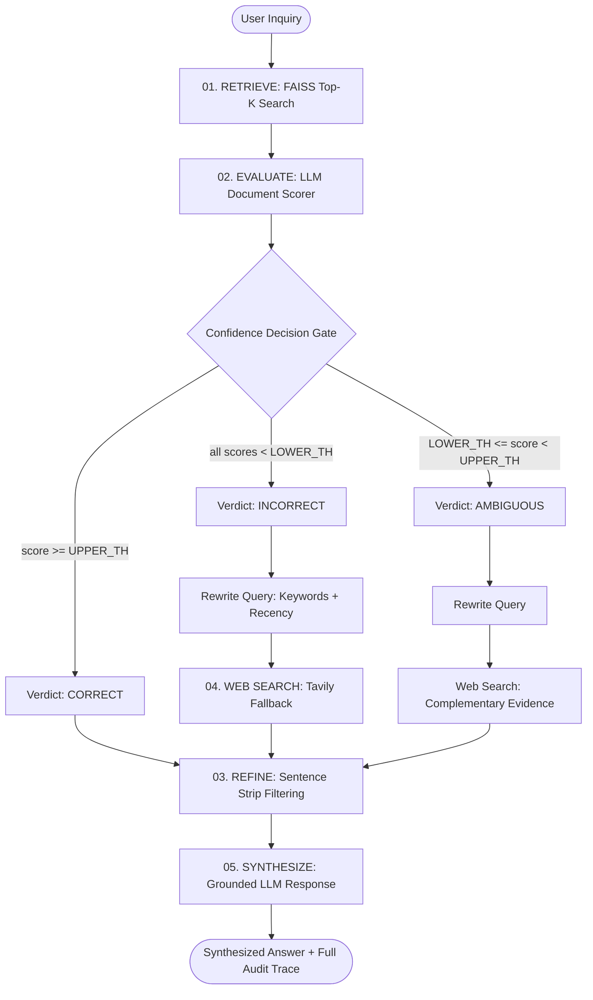

# RealTea Architecture & Technical Blueprint

This document details the software architecture, state machine orchestration, data flow, and design decisions behind **RealTea**, a production-grade implementation of the **Corrective Retrieval-Augmented Generation (CRAG)** framework.

---

## 1. System Overview

RealTea decouples information retrieval from synthesis through an active evaluation and self-correction loop. When internal document retrieval lacks sufficient evidence or produces low-confidence matches, the system dynamically reformulates the query and pulls live web intelligence, filtering out extraneous noise before final answer generation.



---

## 2. LangGraph State Machine Specification

The core execution graph is defined using **LangGraph** (`langgraph.graph.StateGraph`). Every node in the state graph operates on a shared typed state dictionary.

### 2.1. State Schema (`GraphState`)

| State Key | Type | Description |
| :--- | :--- | :--- |
| `question` | `str` | The original user inquiry. |
| `documents` | `List[Document]` | Raw chunks retrieved from the local FAISS vector store. |
| `doc_evaluations` | `List[DocEvaluation]` | Evaluator verdict, numeric score ($0.0 - 1.0$), and justification per chunk. |
| `verdict` | `str` | Tri-action classification: `"CORRECT"`, `"INCORRECT"`, or `"AMBIGUOUS"`. |
| `verdict_reason` | `str` | Natural language explanation summarizing why the verdict was assigned. |
| `web_search_needed` | `bool` | Flag indicating whether external web search must be triggered. |
| `web_query` | `str` | Keyword-optimized search query created by the rewriter. |
| `web_docs` | `List[WebSearchResult]` | External documents scraped and parsed from Tavily. |
| `all_strips` | `List[str]` | Atomic sentence units segmented from candidate texts. |
| `kept_strips` | `List[str]` | High-confidence sentence strips that passed relevance verification. |
| `refined_context` | `str` | Recomposed, clean context string passed to the generator. |
| `answer` | `str` | Final synthesized response grounded strictly on verified context. |
| `execution_path` | `List[str]` | Chronological audit trail of visited graph nodes. |

---

## 3. Pipeline Stages in Detail

### Stage 1: Document Retrieval (`retrieve`)
- Retrieves the top-$k$ most similar chunks ($k=4$ by default) from the persistent FAISS index.
- Chunks are matched using cosine similarity over normalized embeddings generated by `text-embedding-3-small`.

### Stage 2: Document Evaluation (`eval_each_doc`)
- Each retrieved chunk is evaluated individually against the input query.
- The evaluator model inspects both factual relevance and semantic completeness, returning:
  - `score`: Continuous value between $0.0$ and $1.0$.
  - `reason`: Justification for the score.
  - `passed_upper`: Boolean (`score >= UPPER_TH`).
  - `passed_lower`: Boolean (`score >= LOWER_TH`).
- Aggregates chunk scores into an overall verdict:
  - **`CORRECT`**: At least one chunk satisfies $\text{score} \ge \text{UPPER\_TH}$ ($0.7$).
  - **`INCORRECT`**: Every chunk satisfies $\text{score} < \text{LOWER\_TH}$ ($0.3$).
  - **`AMBIGUOUS`**: Intermediate relevance or partial alignment.

### Stage 3: Dynamic State Routing (`route_after_eval`)
- Conditional edge handler in LangGraph:
  ```python
  def route_after_eval(state: GraphState) -> str:
      verdict = state.get("verdict", "INCORRECT")
      if verdict == "CORRECT":
          return "refine"
      return "rewrite_query"
  ```

### Stage 4: Query Reformulation (`rewrite_query`)
- Transforms conversational or complex user inquiries into concise search strings (6–14 keywords).
- Appends temporal recency qualifiers (e.g. `(last 30 days)`) when the query involves current events, market trends, or recent AI developments.

### Stage 5: Web Search Augmentation (`web_search`)
- Calls the **Tavily Search API** with search depth set to `"advanced"`.
- Collects raw URLs, page titles, and textual content snippets.
- Incorporates web snippets as candidate documents for knowledge refinement.

### Stage 6: Sentence-Level Knowledge Refinement (`refine`)
- Decomposes candidate passages into discrete sentence strips using regex sentence boundaries (`[.!?]+`).
- Runs an atomic sentence verification judge to strip out marketing fluff, filler introductory text, and tangential statements.
- Recomposes the surviving strips into a unified, high-density context block `refined_context`.

### Stage 7: Bounded Synthesis (`generate`)
- Synthesizes the final answer using strict grounding instructions:
  - **Constraint 1**: Restrict all assertions strictly to facts stated in `refined_context`.
  - **Constraint 2**: Never extrapolate or hallucinate ungrounded claims.
  - **Constraint 3**: If the refined context cannot support the question, explicitly state the boundary of knowledge.

---

## 4. Vector Storage & Chunking Strategy

- **Source Corpus**: Reference textbooks in `corrective-rag-main/documents/` (`book1.pdf`, `book2.pdf`, `book3.pdf`).
- **Text Splitter**: `RecursiveCharacterTextSplitter` configured with:
  - `chunk_size = 900`
  - `chunk_overlap = 150`
  - `separators = ["\n\n", "\n", ". ", " ", ""]`
- **Embedding Model**: OpenAI `text-embedding-3-small` ($1,536$ dimensions).
- **Index Type**: FAISS `IndexFlatL2` serialized to `storage/faiss_index/` (`index.faiss` and `index.pkl`).
- **Chunk Count**: Exactly **1,956 vector chunks** spanning 835 pages across the three volumes.

---

## 5. Multi-Provider LLM Abstraction

RealTea supports dynamic runtime engine switching without restarts:

| Provider ID | Model Name | Role | Strengths |
| :--- | :--- | :--- | :--- |
| **`gemini`** (Default) | Google Gemini 3.5 Flash Lite | Evaluator, Rewriter, Synthesizer | Ultra-fast inference, high context throughput, zero cold start. |
| **`openai`** | OpenAI GPT-4o-mini | Evaluator, Rewriter, Synthesizer | Reliable structured JSON generation, strong reasoning. |
| **`deepseek`** | DeepSeek Chat | Evaluator, Rewriter, Synthesizer | Cost-efficient open-weights reasoning. |

---

## 6. Frontend Architecture

The user interface adopts a minimalist editorial design language inspired by [Nokta](https://nokta.framer.website/):
- **Framework**: React 18 with Vite for lightning-fast HMR and production bundling.
- **Styling**: Tailwind CSS with custom Nokta design tokens (`nokta-card`, `nokta-pill-nav`, `nokta-pill-btn`).
- **Components**:
  - `Navbar.jsx`: Floating capsule navigation with live studio clock (`STUDIO HH:MM:SS`) and health badges.
  - `QueryConsole.jsx`: Pill-shaped search bar, threshold sliders, engine toggle, and suggested explore pills.
  - `GraphView.jsx`: Visual representation of the 6-stage LangGraph StateGraph showing real-time execution highlighting.
  - `TraceInspector.jsx`: Tabbed deep dive into synthesized answer, retrieved chunks, sentence strip diffs, and raw LangGraph state JSON.
  - `DocumentManager.jsx`: Corpus catalog displaying book volumes, chunk volume, and one-click re-indexing.
  - `BlueprintView.jsx`: Interactive educational breakdown of the 6 notebook stages.
